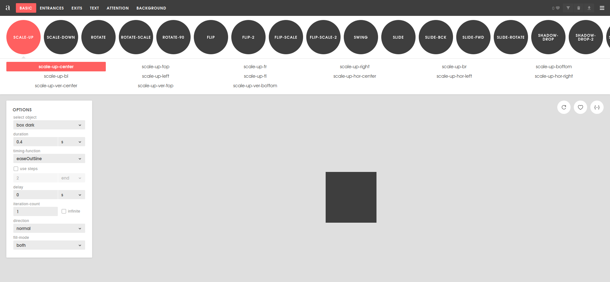
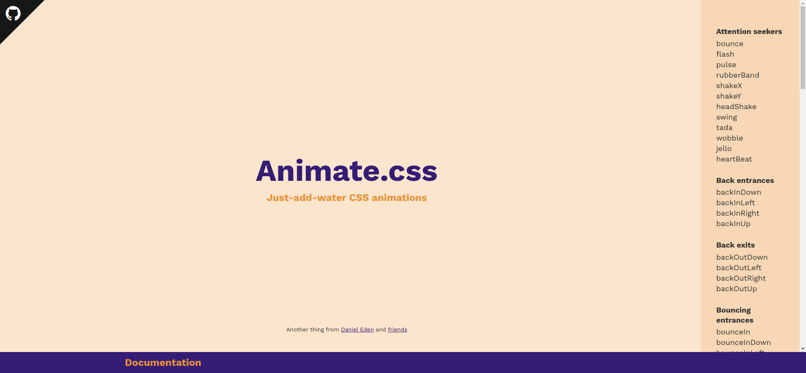
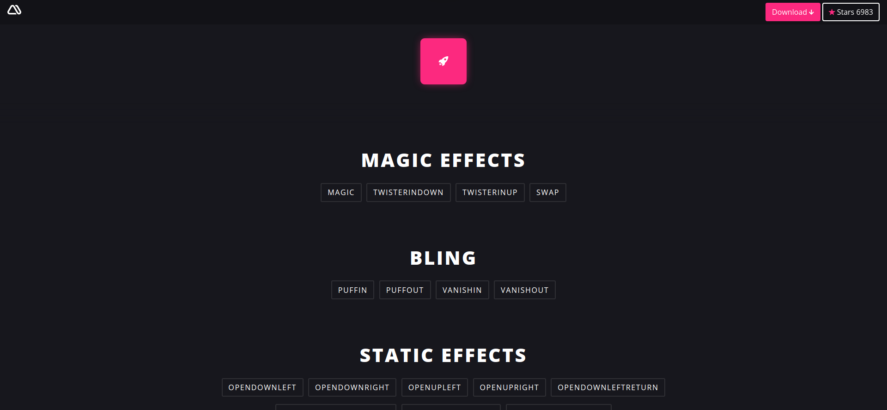
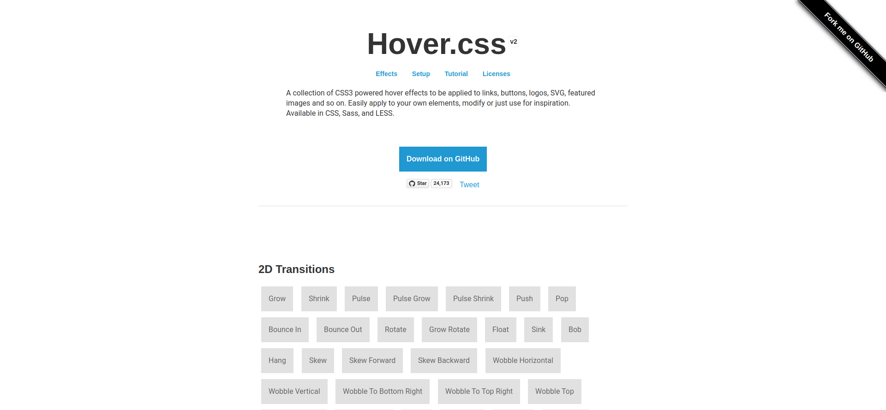
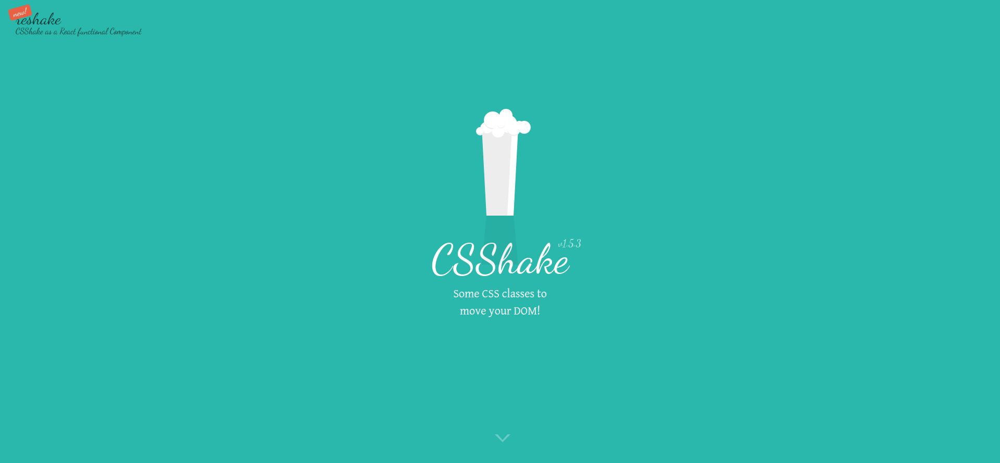
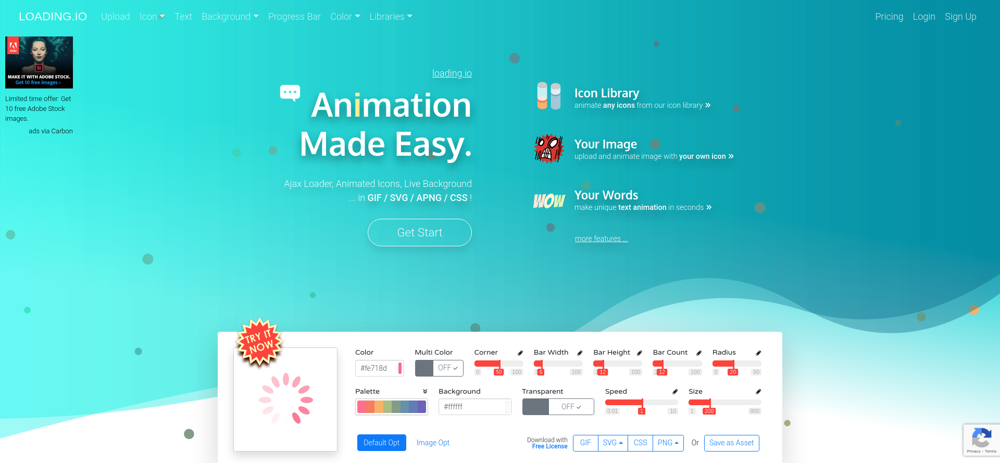

# Animation-Libraries

**[Back to Home](../README.md)**
 
 

## **1. ANIMISTA**

### [Animista - CSS Animations on Demand](https://animista.net/)
Animista is a CSS animation library and a place where you can play with a collection of ready-made CSS animations and download only those you will use.

## **2. ANIMATE.CSS**

### [Animate.css | A cross-browser library of CSS animations.](https://animate.style/)
Animate.css is a library of ready-to-use, cross-browser animations for use in your web projects. Great for emphasis, home pages, sliders, and attention-guiding hints.

## **3. MAGIC EFFECTS**

### [Magic Animations CSS3 - minimamente](https://www.minimamente.com/project/magic/)
Magic Effects. magic. twisterInDown. twisterInUp. swap. Bling. puffIn. puffOut. vanishIn. vanishOut. Static Effects. openDownLeft. openDownRight. openUpLeft.

## **4. HOVER.CSS**

### [Hover.css - A collection of CSS3 powered hover effects](https://ianlunn.github.io/Hover/)
A collection of CSS3 powered hover effects to be applied to links, buttons, logos, SVG, featured images and so on. Easily apply to your own elements, modify or just use for inspiration. Available in CSS, Sass, and LESS.

## **5. CSS SHAKE**

### [CSShake](https://elrumordelaluz.github.io/csshake/)
Some CSS classes to move your DOM!

## **6. LOADING IO**

### [loading.io - Your SVG + GIF + PNG Ajax Loading Icons and Animation Generator](https://loading.io/)
Build Your Ajax Loading Icons, Animated Text and More with SVG / CSS / GIF / PNG !

 

**[Back to Top](#Animation-Libraries)**
 

**[Back to Home](../README.md)**