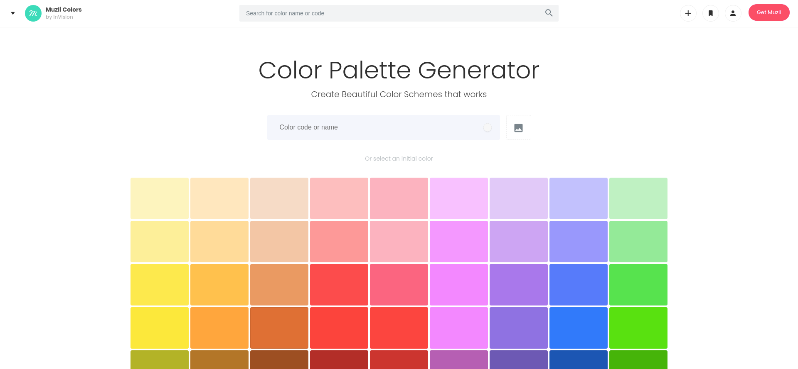
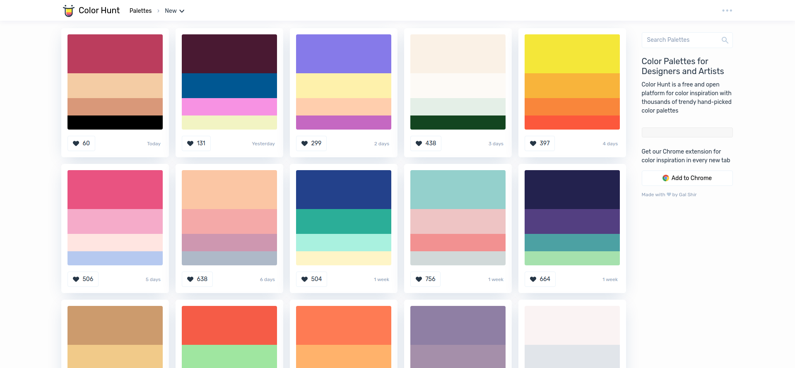
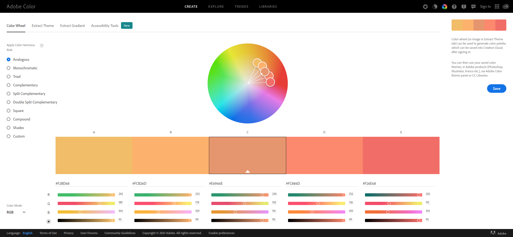
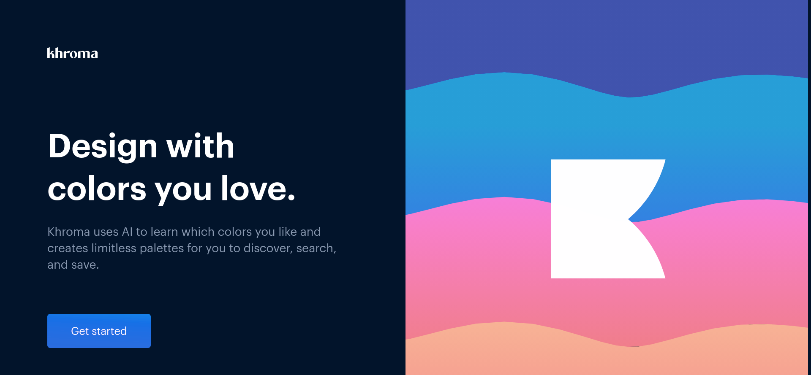
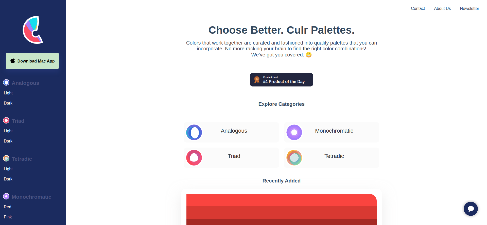
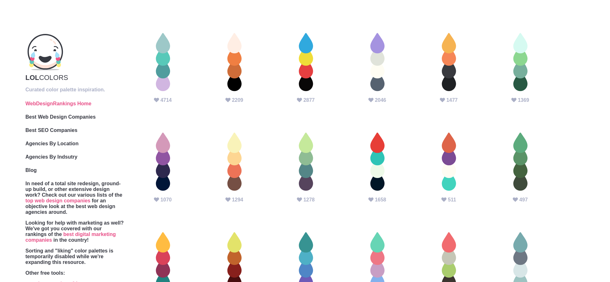
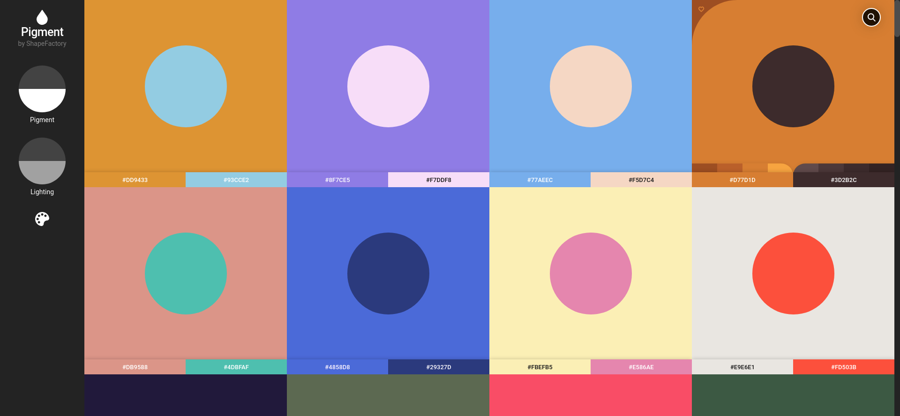
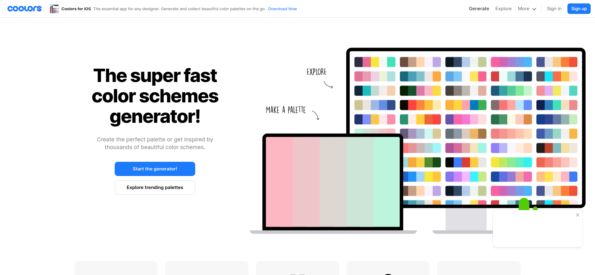

# Colors

**[Back to Home](../README.md)**
 
 

### **1. MUZLI COLORS**

### [Color Palette Generator - Create Beautiful Color Schemes](https://colors.muz.li)
Search, discover, test and create beautiful color palettes for your projects.

## **2. COLOR HUNT**

### [Color Hunt - Color Palettes for Designers and Artists](https://colorhunt.co/)
Color Hunt is a free and open platform for color inspiration with thousands of trendy hand-picked color palettes.

## **3. ADOBE COLOUR**

### [Adobe Color: Color wheel, a color palette generator](https://color.adobe.com)
You can then use your saved color themes, in Adobe products (Photoshop, Illustrator, Fresco etc.), via Adobe Color theme panel or CC Libraries.

## **4. KHROMA**

### [Khroma - The AI color tool for designers](http://khroma.co/)
Khroma is the fastest way to discover, search, and save color combos and palettes you'll love.

## **5. CURLS**

### [Culrs | Culrs gives you a simple smart approach to choose color palettes](https://www.culrs.com/)
Thoughtfully crafted and easy-to-use color palettes.

## **6. LOL COLORS**

### [LOL Colors - Curated color palette inspiration](https://www.webdesignrankings.com/resources/lolcolors/)
Curated color palette inspiration.

## **7. PIGMENT**

### [Pigment by ShapeFactory | Simple Color Palette Generator](https://pigment.shapefactory.co/)
A unique way to generate fresh and vibrant colors based on lighting and pigment, instead of math. Find a beautiful, free color palette in seconds to kick off your next project.

## **8. COOLORS**

### [Coolors - The super fast color schemes generator!](https://coolors.co/)
Generate or browse beautiful color combinations for your designs.

 

**[Back to Top](#colors)**
 

**[Back to Home](../README.md)**