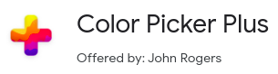

# Extensions

**[Back to Home](../README.md)**
 
 

## **1. Google Translate**

### [Google Translate](https://chrome.google.com/webstore/detail/google-translate/aapbdbdomjkkjkaonfhkkikfgjllcleb?hl=en-US)
Highlight or right-click on a section of text and click on Translate icon next to it to translate it to your language. Or, to translate the entire page you're visiting, click the translate icon on the browser toolbar.

## **2. Grammarly**

### [Grammarly for Chrome](https://chrome.google.com/webstore/detail/grammarly-for-chrome/kbfnbcaeplbcioakkpcpgfkobkghlhen?hl=en-US)
From grammar and spelling to style and tone, Grammarly helps you eliminate writing errors and find the perfect words to express yourself.

## **3. Stylebot**

### [Stylebot](https://chrome.google.com/webstore/detail/stylebot/oiaejidbmkiecgbjeifoejpgmdaleoha?hl=en-US)
You pick an element and choose any changes you want to make from the editor. You can change the font, color, margins, visibility and a lot more. You can also code CSS manually.

## **4. CSSViewer**

### [CSSViewer](https://chrome.google.com/webstore/detail/cssviewer/ggfgijbpiheegefliciemofobhmofgce)
A simple CSS property viewer.

## **5. Responsive Web Design Tester**

### [Responsive Web Design Tester](https://chrome.google.com/webstore/detail/responsive-web-design-tes/enhcpefphhaiikpobimgcakinhabgiib?hl=en-US)
Responsive Web Design Tester is a quick and easy way to test your responsive website.

## **6. Muzli**

### [Muzli 2 - Stay Inspired](https://chrome.google.com/webstore/detail/muzli-2-stay-inspired/glcipcfhmopcgidicgdociohdoicpdfc?hl=en-US)
Bringing you the freshest design, UI, UX and interactive news and shots from around the web. All the design inspiration you need.

## **7. WhatFont**

### [WhatFont](https://chrome.google.com/webstore/detail/whatfont/jabopobgcpjmedljpbcaablpmlmfcogm?hl=en-US)
The easiest way to identify fonts on web pages. What is the easiest way to find out the fonts used in a webpage?

## **8. Fonts Ninja**

### [Fonts Ninja](https://chrome.google.com/webstore/detail/fonts-ninja/eljapbgkmlngdpckoiiibecpemleclhh?hl=en-US)
Our proprietary algorithm analyses font files to get more accurate results. 
Rollover any text to get the font name and CSS properties.

## **9. Image Downloader**

### [Image Downloader](https://chrome.google.com/webstore/detail/image-downloader/cnpniohnfphhjihaiiggeabnkjhpaldj?hl=en-US)
Browse and download images on the web. If you want to download many images at once, with this extension you can:
- Explore images on the current page
- Filter by width, height, or URL
- One-click download or open any single image in a new tab
- Save to a subfolder
- Rename downloaded files
- Download in background!

## **10. Color Picker**

### [Color Picker Plus](https://chrome.google.com/webstore/detail/color-picker-plus/flpfinegbpkablbeaaphkjcpeghmiiif?hl=en-US)
Handy color picker for web designers and developers. Color Picker Plus is a tool that helps you find colors on the pages.

## **11. Nimbus**

### [Nimbus Screenshot & Screen Video Recorder](https://chrome.google.com/webstore/detail/nimbus-screenshot-screen/bpconcjcammlapcogcnnelfmaeghhagj?hl=en-US)
Screen Capture FULL Web page or any part. Edit screenshots. Record screencasts - record video from your screen.

## **12. Dark Reader**

### [Dark Reader](https://chrome.google.com/webstore/detail/dark-reader/eimadpbcbfnmbkopoojfekhnkhdbieeh?hl=en-US)
Dark mode for every website. Take care of your eyes, use dark theme for night and daily browsing.

 

**[Back to Top](#Extensions)**
 

**[Back to Home](../README.md)**