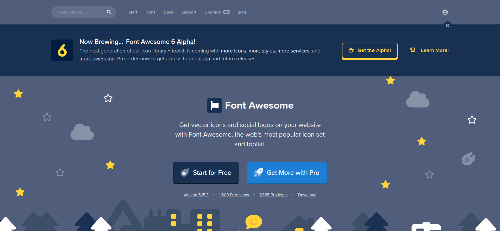
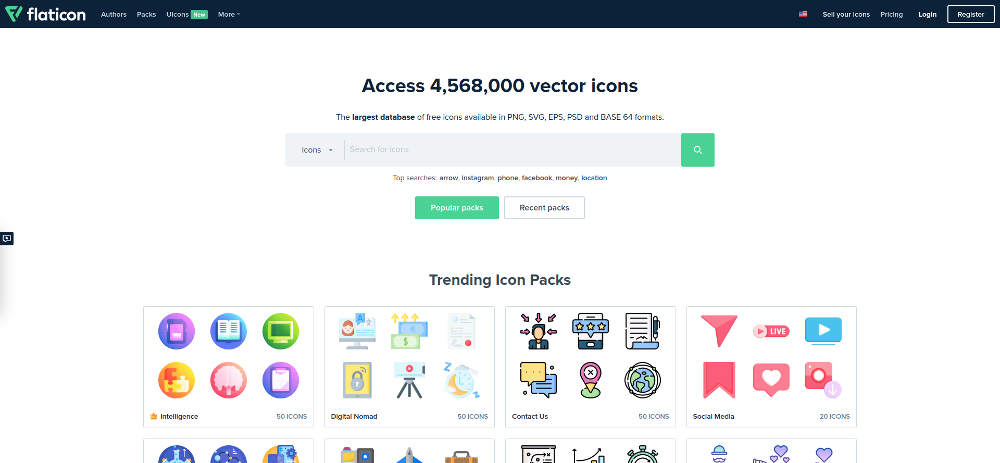

# Icons

**[Back to Home](../README.md)**
 
 

## **1. GOOGLE MATERIAL ICONS**

### [Icons - Google Fonts](https://fonts.google.com/icons)
Material Icons are available in five styles and a range of downloadable sizes and densities. The icons are based on the core Material Design principles and metrics.

## **2. FONT AWESOME**

### [Font Awesome](https://fontawesome.com/)
The world's most popular and easiest to use icon set just got an upgrade. More icons. More styles. More Options.

## **3. ICONSCOUT**

### [Iconscout: Download 3M+ Icons, 3D Illustrations & Lottie Animations | Iconscout](https://iconscout.com/)
Download 3 Million+ high-quality free vector Icons, Illustrations, 3D assets, and Lottie Animations that are available in static & animated formats at Iconscout.

## **4. NOUN PROJECT**

### [Noun Project: Free Icons & Stock Photos for Everything](https://thenounproject.com/)
Noun Project features the most diverse collection of icons and stock photos ever. Download SVG and PNG. Browse over 3 million art-quality icons and photos.

## **5. EVA ICONS**

### [Eva Icons - beautifully craf ted Open Source UI icons for common actions and items.](https://akveo.github.io/eva-icons/)
Eva Icons is a pack of 480 delightful icons available for free. Download Eva Icons to use them in your products for mobile and web apps. Available as SVG, PNG, Web Font and Sketch. Open Source, built by the Nebular team.

## **6. FLATICON**

### [Flaticon](https://www.flaticon.com/)
4568000+ Free vector icons in SVG, PSD, PNG, EPS format or as ICON FONT. Thousands of free icons in the largest database of free vector icons!

## **7. ICON8**

### [Icons8](https://icons8.com/)
Download design elements for free: icons, photos, vector illustrations, and music for your videos. All the assets made by designers → consistent quality.

## **8. REMIX**

### [Remix Icon - Open source icon library](https://remixicon.com/)
Remix Icon is a set of open source neutral style system symbols elaborately crafted for designers and developers. All of the icons are free to use for both personal and commercial.

## **9. ICONSET**

### [Iconset - Free Icons Organizer & Manager for Mac and Windows](https://iconset.io/)
Free SVG vector icons, icon sets & icon packs organizer and manager app for designers, developers and teams. Works on both macOS and Windows!

 

**[Back to Top](#Icons)**
 

**[Back to Home](../README.md)**