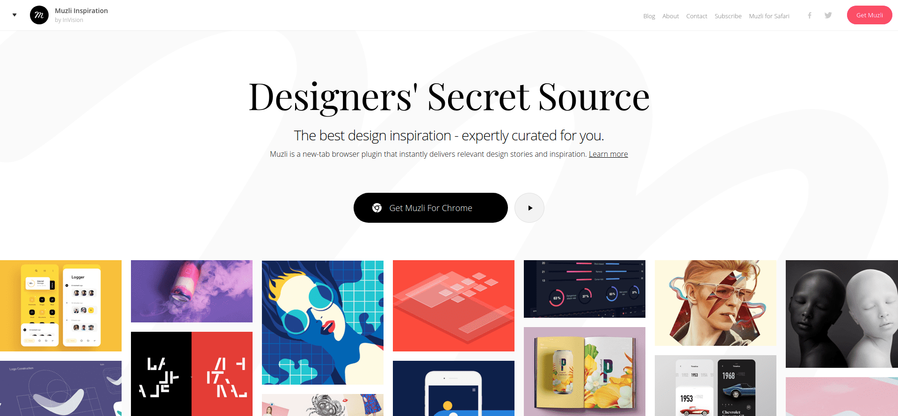
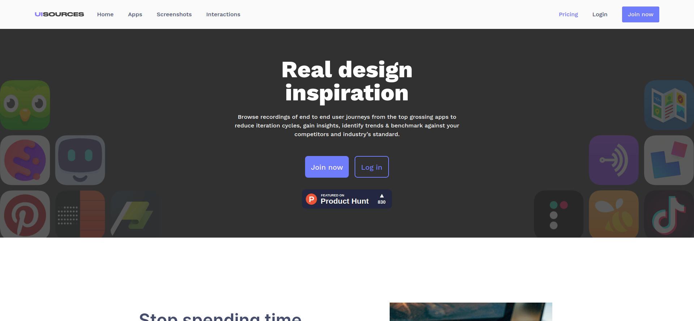
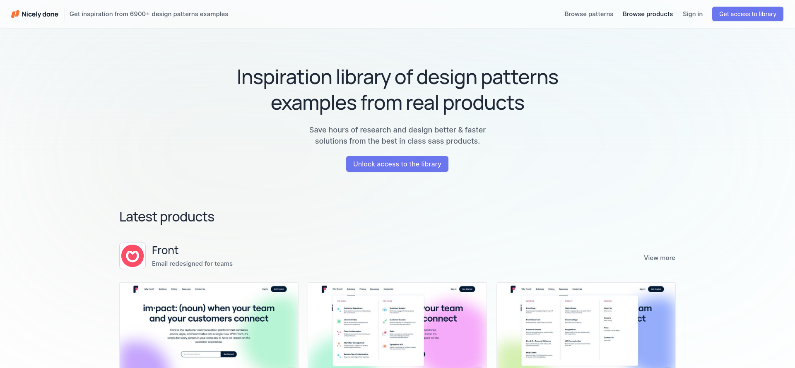
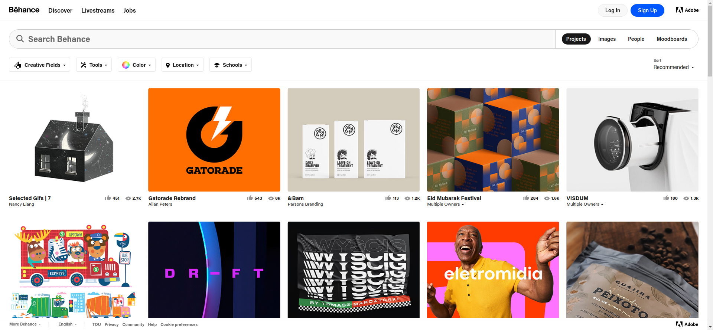
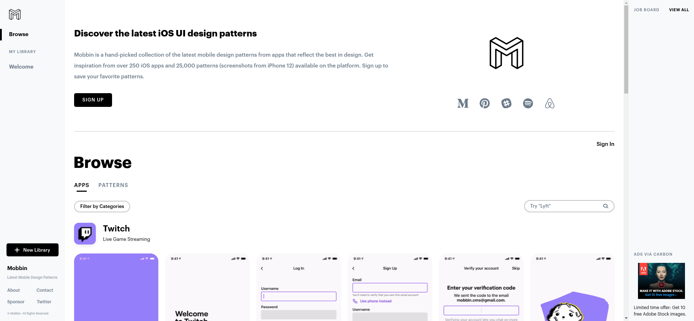
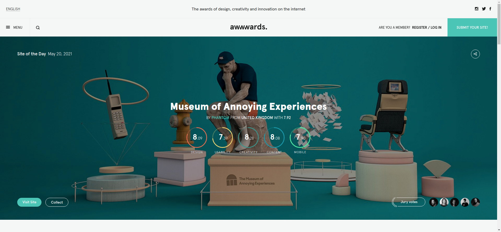
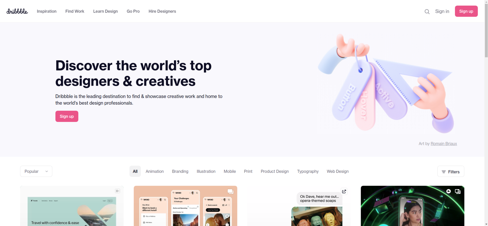
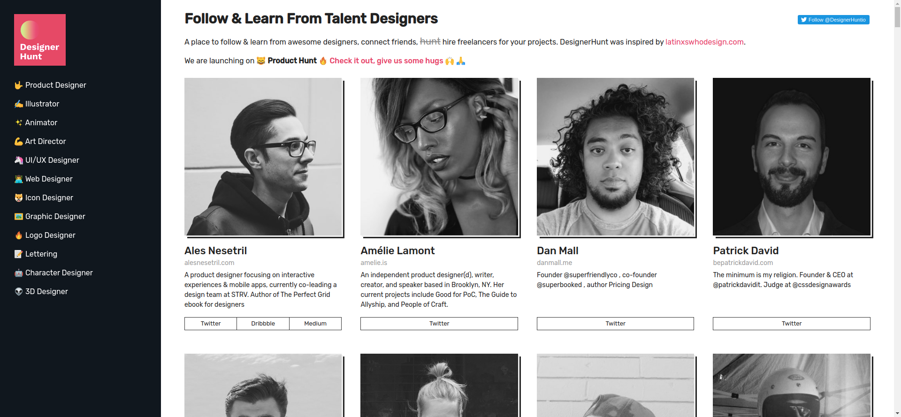

# Inspiration

**[Back to Home](../README.md)**
 
 

## **1. MUZLI**

### [Muzli Design Inspiration](https://muz.li/)
Designers' Secret Source: all the design inspiration you need. Served fresh. The best design inspiration - expertly curated for you. Muzli is a new-tab browser plugin that instantly delivers relevant design stories and inspiration

## **2. UI SOURCES**

### [UI Sources | Mobile Design Patterns and Interactions](https://www.uisources.com/)
Get real design inspiration from the world's best designed apps. Analyze flows & interactions and get new insights.

## **3. NICELY DONE**

### [UX & UI patterns | Saas product inspiration • Nicely done](https://nicelydone.club/)
Nicely done is a library of UX design patterns and product inspiration. It features a wide range of proven products from leading companies around the world.

## **4. BEHANCE**

### [Behance](https://www.behance.net/)
Behance is the world's largest creative network for showcasing and discovering creative work.

## **5. MOBBIN**

### [Mobbin - Latest Mobile Design Patterns](https://mobbin.design/)
Check out the hand-picked collection of latest mobile design patterns from apps that reflect the best in design.

## **6. AWWWARDS**

### [Awwwards - Website Awards - Best Web Design Trends](https://www.awwwards.com/)
Awwwards are the Website Awards that recognize and promote the talent and effort of the best developers, designers and web agencies in the world.

## **7. DRIBBBLE**

### [Dribbble - Discover the world’s top designers & creatives](https://dribbble.com/)
Dribbble is where designers gain inspiration, feedback, community, and jobs and is your best resource to discover and connect with designers worldwide.

## **8. DESIGNER HUNT**

### [Follow & Learn From Talent Designers - DesignerHunt.io](https://www.designerhunt.io/)
Follow & Learn From Talent Designers. A place to follow & learn from awesome designers, connect friends, hire freelancers for your projects. DesignerHunt was inspired by latinxswhodesign.com.
 

**[Back to Top](#Inspiration)**
 

**[Back to Home](../README.md)**