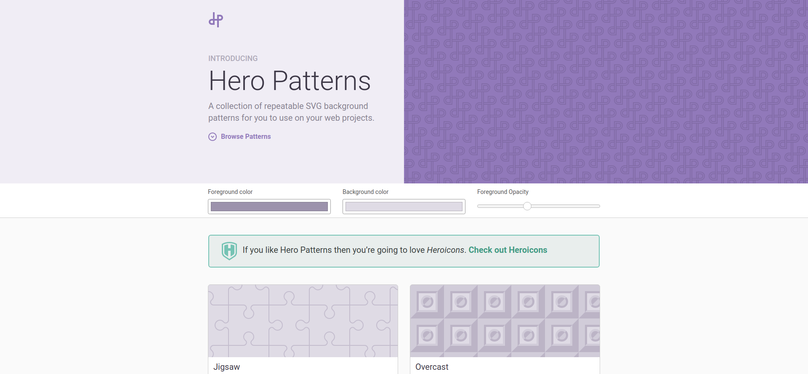

# Pattern

**[Back to Home](../README.md)**
 
 

## **1. PAAATTERNS**

### [Paaatterns! for Free - LS Graphics](https://products.ls.graphics/paaatterns/)
paaatterns - Free collection of beautiful patterns for all vector formats

## **2. THE PATTERN LIBRARY**

### [The Pattern Library](http://thepatternlibrary.com/)
Patterns for the people, by the people.

## **3. HERO PATTERNS**

### [Hero Patterns | Free repeatable SVG background patterns for your web projects](https://www.heropatterns.com/)
Hero Patterns. A collection of repeatable SVG background patterns for you to use on your web projects. Browse Patterns.

## **4. PATTERNICO**

### [Patternico](https://patternico.com/)
create your own free seamless patterns and backgrounds online fast and easy. Try our pattern generator - it is totally free!

 

**[Back to Top](#Pattern)**
 

**[Back to Home](../README.md)**