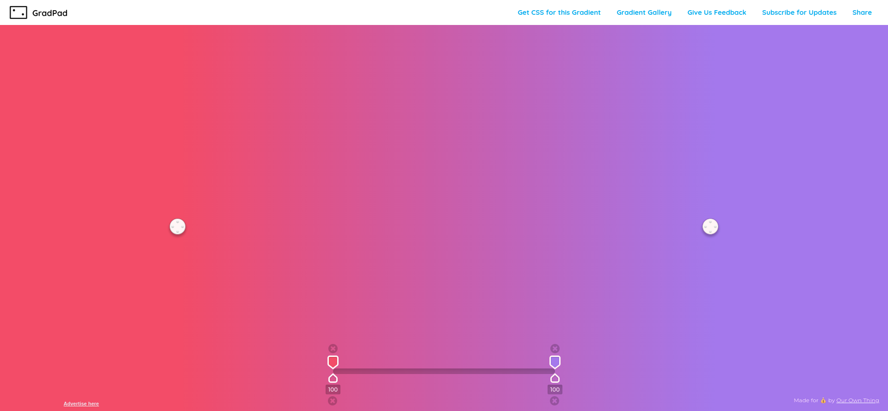
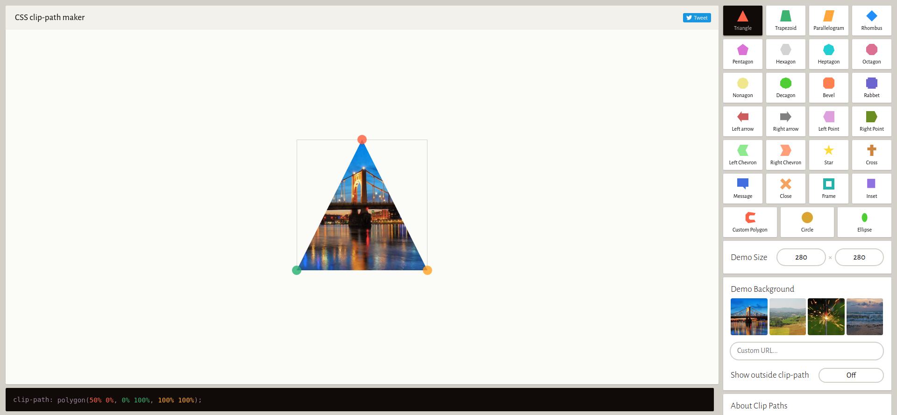
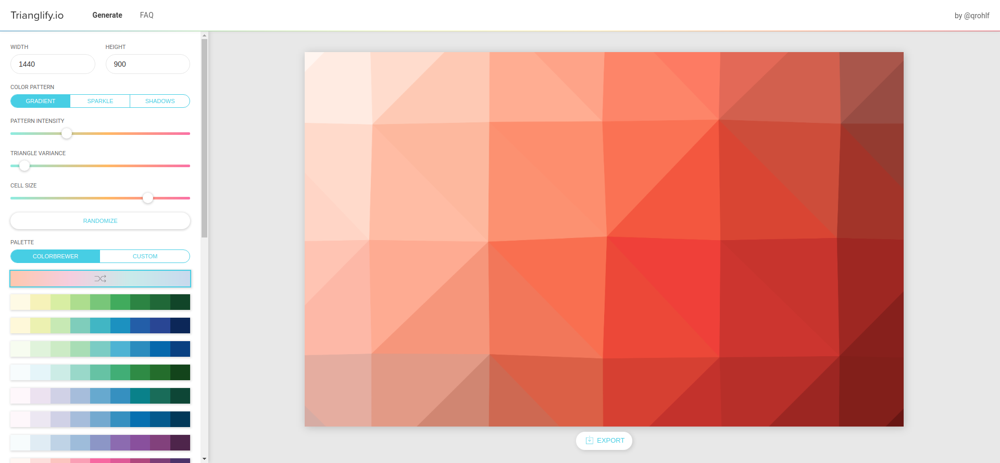
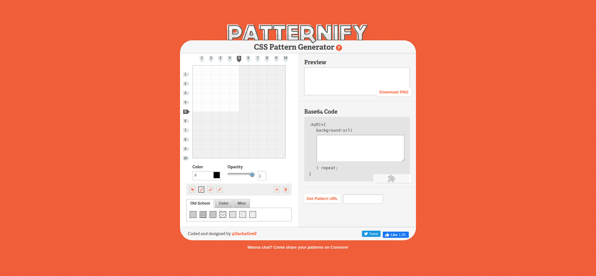
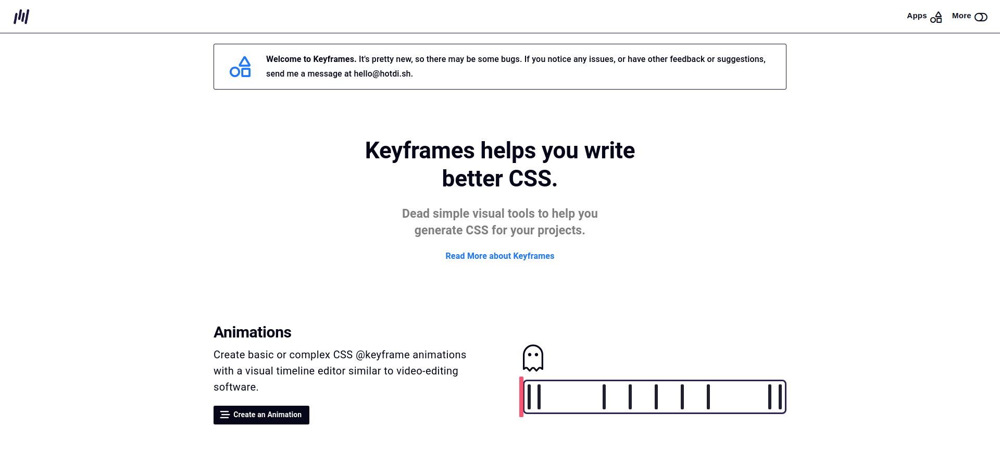

# Tools

**[Back to Home](../README.md)**
 
 

## **1. GRADPAD**

### [CSS Colour Gradients with GradPad, beautiful CSS color gradient generator for your designs](http://ourownthing.co.uk/gradpad.html)
CSS gradient generator, create lovely CSS color gradients for web designs in the browser

## **2. CLIPPY**

### [Clippy — CSS clip-path maker - Bennett Feely](https://bennettfeely.com/clippy/)
The clip-path property allows you to make complex shapes in CSS by clipping an element to a basic shape (circle, ellipse, polygon, or inset), or to an SVG source.

## **3. TRIANGLIFY**

### [Trianglify.io · Low Poly Pattern Generator](https://trianglify.io/)
Trianglify.io is a tool for generating low poly triangle patterns that can be used as wallpapers and website assets.

## **4. PATTERNIFY**

### [Patternify | CSS Pattern Generator](http://www.patternify.com/)
What is Patternify? Patternify is a simple pattern generator. · Instructions. Draw your pattern on the grid.

## **5. KEYFRAMES**

### [Keyframes.app](https://keyframes.app/)
Keyframes helps you write better CSS.Dead simple visual tools to help you generate CSS for your projects.

 

**[Back to Top](#Tools)**
 

**[Back to Home](../README.md)**